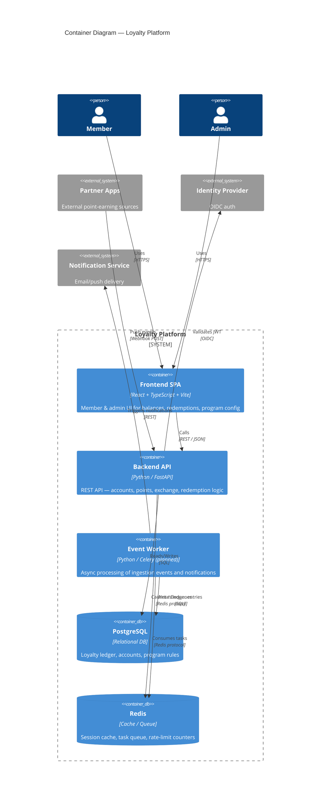
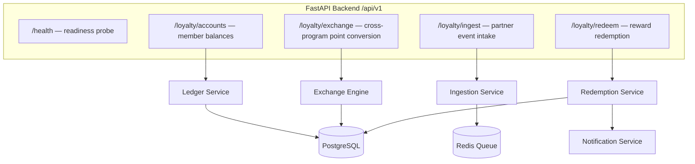

# Container / Component Architecture

Shows the major runtime containers and their responsibilities within the loyalty platform boundary.

## Component Breakdown (Backend API)

## Design Rationale

| Decision | Rationale |
|----------|-----------|
| Single FastAPI process for all REST routes | Simplicity at current scale; split later by domain if load requires |
| Celery worker for async ingestion | Partner event spikes shouldn't block user-facing latency |
| Redis as both cache and broker | Reduces infra surface; revisit if queue depth exceeds Redis capacity |
| PostgreSQL for ledger | ACID guarantees are non-negotiable for financial-grade point balances |
