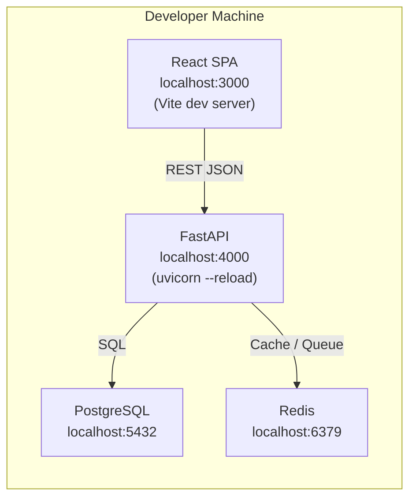
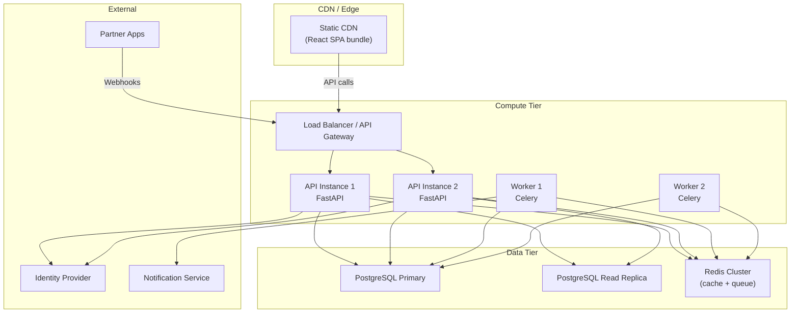

# Deployment / Runtime View

Shows the physical runtime topology for local development and the target cloud deployment.

## Local Development Topology

## Target Cloud Deployment

## Environment Matrix

| Environment | Frontend | Backend | Database | Redis | Notes |
|-------------|----------|---------|----------|-------|-------|
| Local | Vite dev server :3000 | uvicorn :4000 | Docker postgres :5432 | Docker redis :6379 | Single-process, hot-reload |
| Staging | CDN (preview URL) | 1 API + 1 Worker | Managed PG (small) | Managed Redis (single) | Mirrors prod topology |
| Production | CDN (custom domain) | 2+ API + 2+ Workers | Managed PG (HA) | Redis Cluster | Auto-scaling, read replicas |

## Infrastructure Decisions

| Decision | Rationale |
|----------|-----------|
| SPA served from CDN, not from API | Independent deploy cadence; zero backend load for static assets |
| API Gateway in front of API instances | Centralized rate-limiting, auth pre-check, TLS termination |
| Read replica for query-heavy paths | Isolate analytics/reporting queries from write path |
| Workers scale independently | Ingestion spikes don't require scaling user-facing API |
