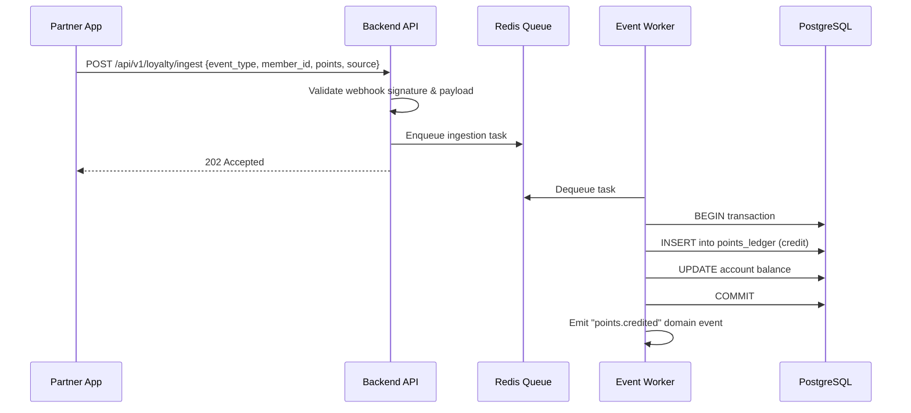
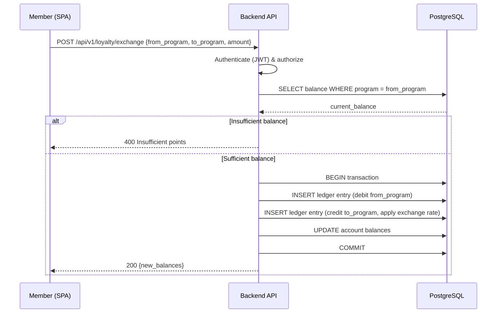
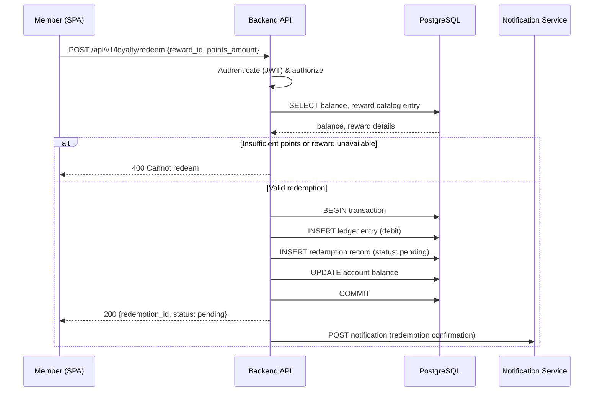

# Core Sequence: Points Ingestion → Exchange → Redemption

End-to-end flow showing how points enter the system, get exchanged between programs, and are redeemed for rewards.

## 1. Points Ingestion

## 2. Points Exchange (Cross-Program Conversion)

## 3. Reward Redemption

## Invariants

1. **Double-entry ledger** — every point movement is a debit+credit pair; total system points are zero-sum.
2. **Idempotency** — ingestion events carry a unique `event_id`; duplicates are detected and ignored.
3. **Atomicity** — balance updates and ledger writes are always in the same DB transaction.
4. **Exchange rates** — stored in a program-rules table; changes apply only to future exchanges.
