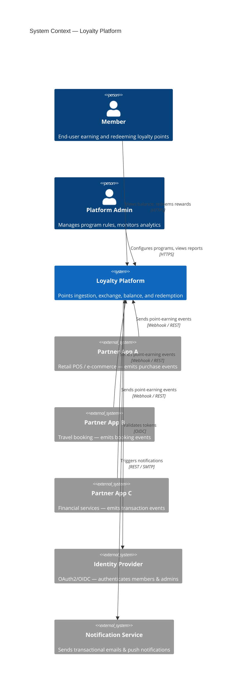

# System Context Diagram

Shows the loyalty platform in relation to its users and external systems.

## Key Observations

| Aspect | Decision |
|--------|----------|
| Ingestion model | Partner apps push events via webhook; platform does not poll |
| Auth | Delegated to an external IdP (JWT-based) |
| Notifications | Decoupled — platform emits events, notification service delivers |
